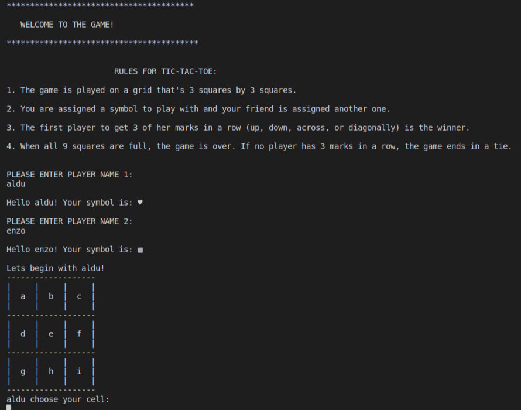

# Tic-Tac-Toe

Tic-Tac-Toe is a game in which two players alternately put Xs and Os in compartments of a figure formed by two vertical lines crossing two horizontal lines and each tries to get a row of three Xs or three Os before the opponent does

### First Known Use of tic-tac-toe

Some ascribe the origin of Tic-Tac-Toe to the ancient Egyptians, but the most concrete ancient record we have of the game is from the Romans, and the game they referred to as terni lapilli, or three pebbles at a time.

### Etimology

Historians aren’t completely clear about the origin of the game’s name, but it could be referring to the noise of repetitive ticking or writing that goes along with the game’s play.

- [Merriam](https://www.merriam-webster.com/dictionary/tic-tac-toe)
- [Aurosi](https://aurosi.com/blog/the-history-of-tic-tac-toe-and-where-it-is-now/)

### Rules 

1. The game is played on a grid that's 3 squares by 3 squares.

2. You are assigned a symbol to play with and your friend is assigned another one.'

3. The first player to get 3 of her marks in a row (up, down, across, or diagonally) is the winner.

4. When all 9 squares are full, the game is over. If no player has 3 marks in a row, the game ends in a tie.

## Built with 

-Ruby

## How to play this game?

- [On your machine](#On-your-machine)
- [Using live demo](#Using-live-demo)

### On your machine 

**Prerequisites**
- Install [Ruby](https://www.ruby-lang.org/es/documentation/installation/)
- Using an OS terminal friendly (Linux based, Mac OS). If that's not your case go to [Using live demo](#Using-live-demo)

**In case you use Git**

1. Open terminal 

2. Run the following commands:

- git clone https://github.com/AlduLonghi/Tic-Tac-Toe.git

- cd Tic-Tac-Toe

- bin/main.rb

3. Follow the game instructions 

**In case you don't use a control version system**

1. Go to [the repository](https://github.com/AlduLonghi/Tic-Tac-Toe)

2. Press the green button that says "Code".

3. Press "Download zip".

4. Once downloaded, extract the files.

5. Right click on the folder, press "Open in terminal".

6. Run bin/main.rb

7. Follow the game instructions.

### Using live demo 

**Using a single machine**

1. Click [this link](https://repl.it/join/wgnscubb-aldulonghi)

2. Press "Run" on the top.

3. Follow the game instructions.

**Using multiplayer option**

1. Click [this link](https://repl.it/join/wgnscubb-aldulonghi)

2. Press "Share" on the top right corner and invite a friend.

3. Once both are in press "Run".

4. Follow the game instructions.

## Author

👤 **Aldana**
​

- Github: [@AlduLonghi](https://github.com/AlduLonghi)

- Twitter: [@AbrilLonghi](https://twitter.com/AbrilLonghi)

- Linkedin: [Aldana Abril Longhi](https://www.linkedin.com/in/aldana-abril-longhi-a842ba1a7/)

## �� Contributing

- To contribute to this project:
- Fork this repository & clone locally.
- Create an upstream remote and sync your local copy.
- create a new branch.
- Push your code to your origin repository.
- Create a new Pull Request .

## Show your support

Give a ⭐️ if you like this project!
​

## Acknowledgments

- The Odin Project
- Microverse curriculum.
